<div align="center">


</div>

<br>

```bash
tavishi@github:~$ cat about.md
```

> turning ideas into things you can click, one caffeine-fueled commit at a time.
> I build fast, break stuff faster, and fix it before anyone notices. 👾

<br>

<table align="center">
<tr>
<td valign="top" width="50%">

### 📡 connect

<div align="left">

[](https://instagram.com/tavee.shee)
[](https://linkedin.com/in/tavishi-agarwal-592936309)
[](mailto:tavishi.agr@gmail.com)

</div>

</td>
<td valign="top" width="50%">

### ⚡ currently

```yaml
role: BTech student
status: shipping small, breaking often
mood: semicolons optional, stars mandatory
```

</td>
</tr>
</table>

---

### 🧩 stack

<div align="center">

**core**
<br>


**frameworks · data**
<br>


**design**
<br>


</div>

---

### 📊 stats

<div align="center">





</div>

---

### 👻 pac-man vs my commits

<div align="center">

<picture>
  <source media="(prefers-color-scheme: dark)" srcset="https://raw.githubusercontent.com/tavishi-agarwal/tavishi-agarwal/output/pacman-contribution-graph-dark.svg" />
  <source media="(prefers-color-scheme: light)" srcset="https://raw.githubusercontent.com/tavishi-agarwal/tavishi-agarwal/output/pacman-contribution-graph.svg" />
  
</picture>

<sub>⚠️ needs a one-time setup — see note below</sub>

</div>

---

<div align="center">

[](https://visitcount.itsvg.in)

<sub>built in the terminal, deployed with vibes</sub>

</div>
